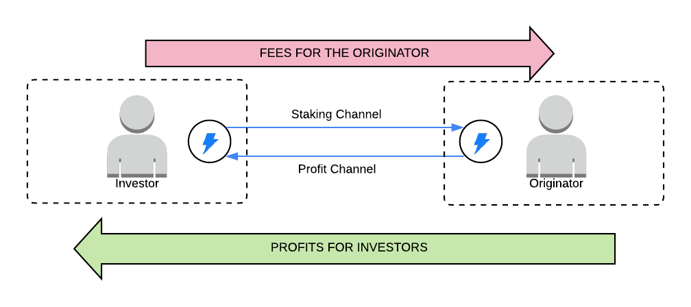
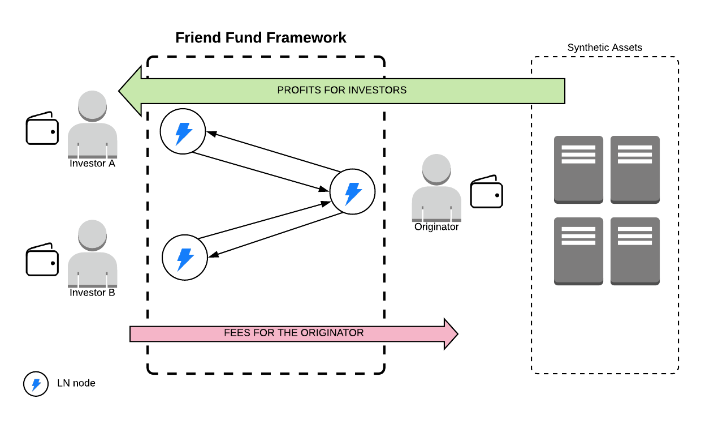
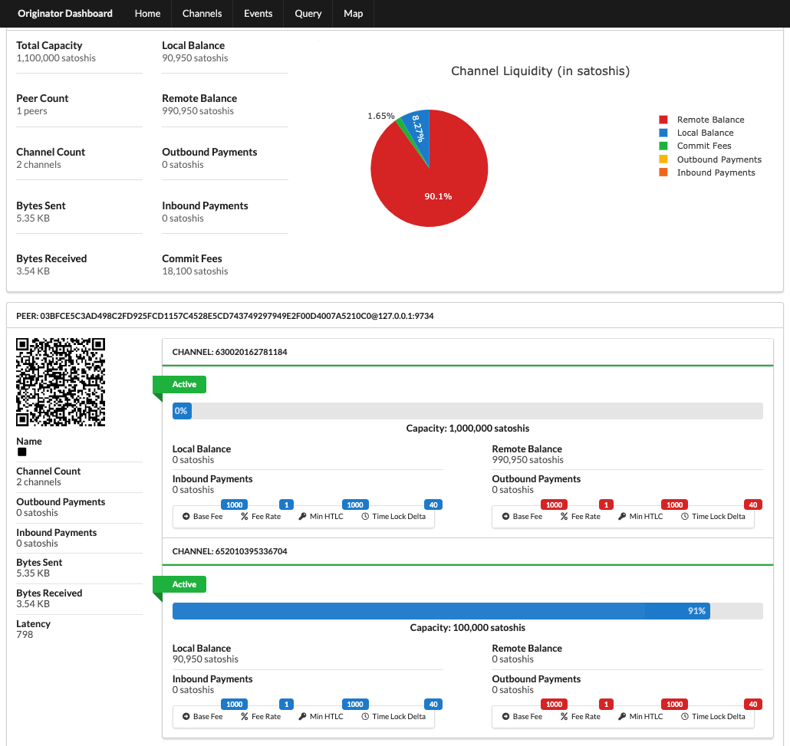
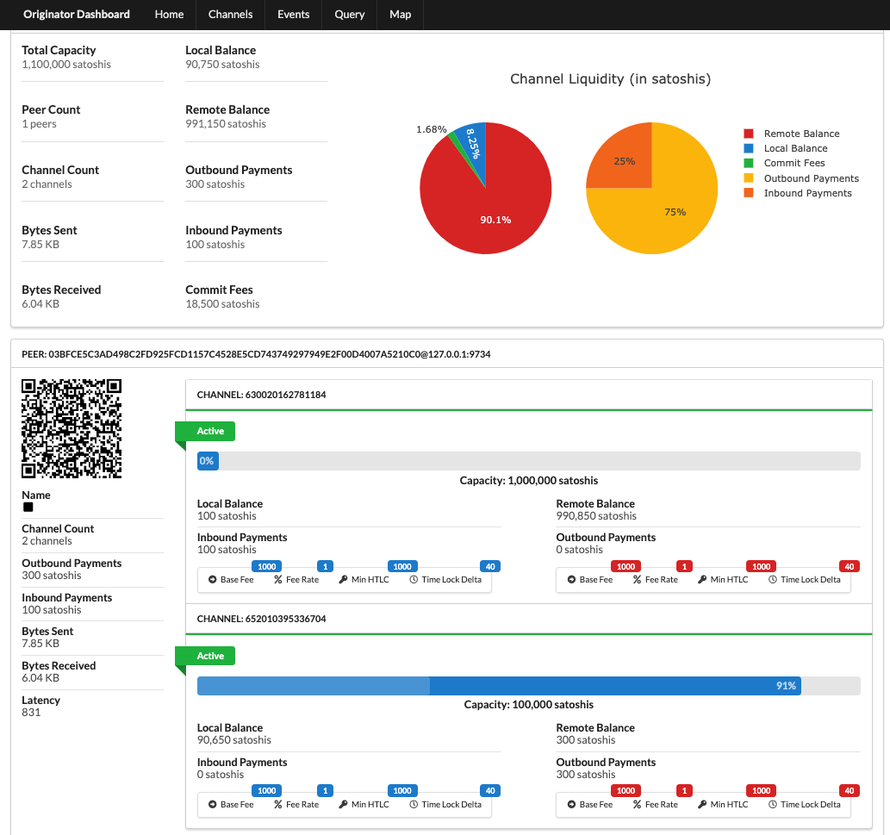

# Friend Fund

## Project Description
Friend Fund is a framework for _managing securitized synthetic assets_ like exchange traded funds (ETFs) or collateralized debt obligations (CDOs) using the Lightning. This framework is designed around to be non-custodial that allows investors to invest in securities created by originators using payment channels.

## Business Description
Friends Fund works on the idea of that a lightning transaction can be opened, Bitcoin can be _committed_, and Bitcoin can then be transferred in small amounts over a period of time.

An *investor* opens up a payment channel to an originator's LN node, this is referred to as the *staking channel* as it gives the investor a stake in the the profits of the the originator's securities.

The *originator* opens a payment channel back to the investor, this is referred to as the *profit channel*. The originator can invoice against the channel to cover their fees and expenses. The originator can also invoice against the channels to distribute the profits (or losses) to the investors.

### Friend Fund Overview


### Friend Fund Cloud Mining Contracts
Consider four masternodes as a synthetic asset that someone would like to securitize. The owner will then setup a Friend Fund on the Lightning network to safely pass the expenses for power and a fee for services on to the investors. The profits are distributed back to the investors. 


# Documentation

## Usage
Running the stack locally:

1. Start the stack using make:
```
make bitcoin-wallet
make lnd-investor-1
make lnd-originator
```
2. Establish connection from investor to originator
:note: Display the originator's connection string (lets other people connect)
```
$ investor-1-lncli connect 03bfce5c3ad498c2fd925fcd1157c4528e5cd743749297949e2f00d4007a5210c0@localhost:9734
$ bitstein-cli generatetoaddress 10 2MwtVAT8QzpPWWw3JJqokLHPVFhFgTsbBnC
```
3. Send the Investor node some Bitcoin so it can open channels:
```
$ investor-1-lncli newaddress np2wkh
  {
      "address": "2N3CvQotjCttq1xE9seJJ1RdgrmXoepuyNP"
  }
$ bitstein-cli sendtoaddress 2N3CvQotjCttq1xE9seJJ1RdgrmXoepuyNP 100
$ bitstein-cli generatetoaddress 10 2N3CvQotjCttq1xE9seJJ1RdgrmXoepuyNP
$ investor-1-lncli walletbalance
```
4. Investor will open a channel for 1000000 sats
```
$ investor-1-lncli openchannel 022016aed883ae43a0e841ffa89a28f6c494f1a746d4c75d12170d5366baf2485e 1000000
  {
  	"funding_txid": "67b7c96ee1615d5bbb24343639be2594d9663f7edcedd8aa3b81a9eb0b4d28bd"
  }
$ bitstein-cli generatetoaddress 20 2N5UvQChMUKektZRzwLT1vmC839JFrmqYpm
```
5. Originator will open a channel back to the investor for 10% of their investment or in this case, 100000:
```
$ originator-lncli openchannel 03bfce5c3ad498c2fd925fcd1157c4528e5cd743749297949e2f00d4007a5210c0 100000
  {
  	"funding_txid": "0043a473902a789f0c20abb3b3c7951998af32086a5c5509f5bab01828ebc95d"
  }
$ bitstein-cli generatetoaddress 20 2N5UvQChMUKektZRzwLT1vmC839JFrmqYpm
```

:information_source: At this point the Originators node has the following state as shown on this screen shot of the LN dashboard:




6. Originator will invoice the investor to cover the fees and the investor will pay the invoice:
```
$ originator-lncli addinvoice -amt 100 --memo "Masternode Fees & Expenses"

  {
  	"r_hash": "1f955a3f66f131d23b2fac0d86a10d54077783e1c7b850e364fb785e76678739",
  	"pay_req": "lnbcrt1u1pw04jy5pp5r72450mx7ycaywe04sxcdggd2srh0qlpc7u9pcmyldu9uan8suusdp2f4shxar9wfhx7er9yprx2etnyqnzq3tcwpjkuum9wvcqzpgcyx3z2map4jhkrwtt8ts236szu7sn3lncc40wprdf5zfpvuyyff482mfldwauqkjkeslksmm9m98m5d0cjhz07336mf80u7k4s7xz5gqrce87t",
  	"add_index": 1
  }

# On the Investor, inspect the pay request
$ investor-1-lncli decodepayreq lnbcrt1u1pw04jy5pp5r72450mx7ycaywe04sxcdggd2srh0qlpc7u9pcmyldu9uan8suusdp2f4shxar9wfhx7er9yprx2etnyqnzq3tcwpjkuum9wvcqzpgcyx3z2map4jhkrwtt8ts236szu7sn3lncc40wprdf5zfpvuyyff482mfldwauqkjkeslksmm9m98m5d0cjhz07336mf80u7k4s7xz5gqrce87t

  {
      "destination": "022016aed883ae43a0e841ffa89a28f6c494f1a746d4c75d12170d5366baf2485e",
      "payment_hash": "1f955a3f66f131d23b2fac0d86a10d54077783e1c7b850e364fb785e76678739",
      "num_satoshis": "100",
      "timestamp": "1559939220",
      "expiry": "3600",
      "description": "Masternode Fees \u0026 Expenses",
      "description_hash": "",
      "fallback_addr": "",
      "cltv_expiry": "40",
      "route_hints": [
      ]
  }

$ investor-lncli payinvoice lnbcrt1u1pw04jy5pp5r72450mx7ycaywe04sxcdggd2srh0qlpc7u9pcmyldu9uan8suusdp2f4shxar9wfhx7er9yprx2etnyqnzq3tcwpjkuum9wvcqzpgcyx3z2map4jhkrwtt8ts236szu7sn3lncc40wprdf5zfpvuyyff482mfldwauqkjkeslksmm9m98m5d0cjhz07336mf80u7k4s7xz5gqrce87t

  Description: Masternode Fees & Expenses
  Amount (in satoshis): 100
  Destination: 022016aed883ae43a0e841ffa89a28f6c494f1a746d4c75d12170d5366baf2485e
  Confirm payment (yes/no): yes
  {
  	"payment_error": "",
  	"payment_preimage": "d098d8055c30773e4cfe535b4b5c1ac56c92141542645a1f28624f295e2a240a",
  	"payment_route": {
  		"total_time_lock": 652,
  		"total_amt": 100,
  		"hops": [
  			{
  				"chan_id": 630020162781184,
  				"chan_capacity": 1000000,
  				"amt_to_forward": 100,
  				"expiry": 652,
  				"amt_to_forward_msat": 100000,
  				"pub_key": "022016aed883ae43a0e841ffa89a28f6c494f1a746d4c75d12170d5366baf2485e"
  			}
  		],
  		"total_amt_msat": 100000
  	}
  }
```
7. After fees have been paid, the investor will invoice the Originator for their profits:
```
$ investor-1-lncli addinvoice -amt 300 --memo "Masternode Profits"

  {
  	"r_hash": "1b82eb09a6f1b0372fc897db2a2a2e522c5ad1fbb981a3046b40ec6ed92df6c3",
  	"pay_req": "lnbcrt3u1pw04j4epp5rwpwkzdx7xcrwt7gjldj523w2gk9450mhxq6xprtgrkxakfd7mpsdqaf4shxar9wfhx7er9ypg8ymmxd968xcqzpgkclwgknznsc64c0s509j8ed9u84he8snxhfmwskjwpgd8zasqdkrlpvqmjc08dx9rhgw6zdnz5su7u6zpsnxmvccue6n78g6e34k67qp8nhp3k",
  	"add_index": 1
  }

# On the Originator, inspect the pay request
$ originator-lncli decodepayreq lnbcrt3u1pw04j4epp5rwpwkzdx7xcrwt7gjldj523w2gk9450mhxq6xprtgrkxakfd7mpsdqaf4shxar9wfhx7er9ypg8ymmxd968xcqzpgkclwgknznsc64c0s509j8ed9u84he8snxhfmwskjwpgd8zasqdkrlpvqmjc08dx9rhgw6zdnz5su7u6zpsnxmvccue6n78g6e34k67qp8nhp3k

    {
        "destination": "03bfce5c3ad498c2fd925fcd1157c4528e5cd743749297949e2f00d4007a5210c0",
        "payment_hash": "1b82eb09a6f1b0372fc897db2a2a2e522c5ad1fbb981a3046b40ec6ed92df6c3",
        "num_satoshis": "300",
        "timestamp": "1559939769",
        "expiry": "3600",
        "description": "Masternode Profits",
        "description_hash": "",
        "fallback_addr": "",
        "cltv_expiry": "40",
        "route_hints": [
        ]
    }

$ originator-lncli payinvoice lnbcrt3u1pw04j4epp5rwpwkzdx7xcrwt7gjldj523w2gk9450mhxq6xprtgrkxakfd7mpsdqaf4shxar9wfhx7er9ypg8ymmxd968xcqzpgkclwgknznsc64c0s509j8ed9u84he8snxhfmwskjwpgd8zasqdkrlpvqmjc08dx9rhgw6zdnz5su7u6zpsnxmvccue6n78g6e34k67qp8nhp3k

    Description: Masternode Profits
    Amount (in satoshis): 300
    Destination: 03bfce5c3ad498c2fd925fcd1157c4528e5cd743749297949e2f00d4007a5210c0
    Confirm payment (yes/no): yes
    {
    	"payment_error": "",
    	"payment_preimage": "a7909d6f2776d34c3d7a92fc9456292a28154338a65589c89be73a590ab561a1",
    	"payment_route": {
    		"total_time_lock": 672,
    		"total_amt": 300,
    		"hops": [
    			{
    				"chan_id": 652010395336704,
    				"chan_capacity": 100000,
    				"amt_to_forward": 300,
    				"expiry": 672,
    				"amt_to_forward_msat": 300000,
    				"pub_key": "03bfce5c3ad498c2fd925fcd1157c4528e5cd743749297949e2f00d4007a5210c0"
    			}
    		],
    		"total_amt_msat": 300000
    	}
    }
```

:information_source: At this point, the Originator's dashboard looks like this:




##  Originator Dashboard (a.k.a lndash)
We just use the lndash project to be our "originator dashboard."

Follow the instructions to run the LN dashboard and configure it to point to the originators LN node:
```
$ cd lndash
$ export LNDASH_LND_SERVER="127.0.0.1:10009"
$ gunicorn main:app
```

## Setup Bitcoin Daemon and LND on Localhost
Follow the instructions [here](https://medium.com/@bitstein/setting-up-a-bitcoin-lightning-network-test-environment-ab967167594a) for setting up a local development environment.
